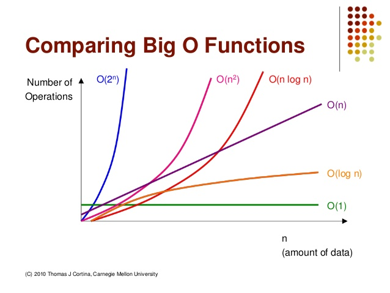

#Week3
## 1. 스케줄링 문제에 접근하는 이진 탐색 트리 소개
### 이진탐색트리란?
이진 탐색 트리는 Binary Search Tree 약자로 BST라고 부르며 이진 트리 기반의 탐색을 위한 자료구조로, 효율적인 탐색 작업을 위해 많이 사용된다.  
__key(왼쪽서브트리)≤key(루트노드)≤key(오른쪽서브트리)__
이진탐색를 중위순회하면 오름차순으로 정렬된 값을 얻을 수 있다.
### 이진탐색트리의 연산
> * insert(n): 이진 탐색 트리의 특성을 유지하면서 새로운 노드 n을 이진 탐색 트리에 삽입한다.
> * remove(n): 이진 탐색 트리의 특성을 유지하면서 노드 n을 트리에서 삭제한다.
> * search(key): 키 값이 key인 노드를 찾아 반환한다.
> - 이진 탐색 트리에 원소를 삽입하기 위해서는 먼저 탐색을 수행하는 것이 필요한데, 탐색에 실패한 위치가 바로 새로운 노드를 삽입하는 위치이다.
## 2. Big-O 소개
__Big-O 란?__
한국어로 점근표기법 이라고 부르며, 어떤 함수의 증가 양상을 다른 함수와의 비교로 표현하는 수론과 해석학의 방법이다. 컴퓨터과학에서는 __알고리즘의 시간복잡도__ 를 나타내는데 사용되며 입력값과 문제를 해결하는 데 걸리는 시간을 함수 관계로 나타낸 것이라고 볼 수 있다. Big-O에는 4가지의 특징이 있다. 
1. 알고리즘의 시간복잡도를 표현할 때 사용
2. 현실의 시간과 컴퓨터 시스템의 구성(그래픽카드의 성능, 혹은 메인보드의 성능)에 따른 차이가 없음
3. 입력 크기(Input size)는 ∣x∣, O(n)의 시간복잡도는 ∣x∣로 선형함
4. 최악의 경우를 나타냄(최악의 경우를 가능한 tight하게 설정함)
### Big_O의 종류  
|종류|의미|
|:---:|---|
|O(2ⁿ)|n개 입력, 최악의 경우 2ⁿ번 실행|
|O(n³)|n개 입력, 최악의 경우 n³번 실행|
|O(n²)|n개 입력, 최악의 경우 n²번 실행|
|O(n log n)|n개 입력, 최악의 경우 n log n번 실행|
|O(n)|n개 입력, 최악의 경우 n번 실행|
|O(log n)|n개 입력, 최악의 경우 log n번 실행|
|O(1)|n개 입력, 최악의 경우 1번 실행|   

   
* Unsorted Array(정렬되지 않은 배열)
  * Search: O(n)
* Sorted Array(정렬된 배열)
  * Search: O(log n)
  * Compare: O91)
  * Insert: O(n)
* List
  * Search 불가
* Heap
  * Search: O(log n)
  * Compare: O(1)
  * Insert: O(log n)
## 3. 문제풀이
# 98
```C++
```
# 99
```C++
```
# 700
```C++
```
# 701
```C++
```
# 백준 5693
