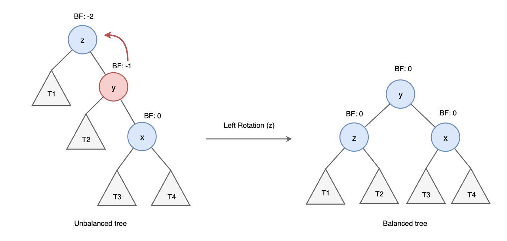

# Week 4
## 1. Data structures augmentation 코딩   
- Rank(순위)
  - 자기보다 작거나 같은 노드의 개수 구하기
```C++
#include <iostream>;
using namespace std;

struct Node {
    int data;
    Node* left, * right;
    int leftSize;
};

Node* newNode(int data)
{
    Node* temp = new Node;
    temp->data = data;
    temp->left = temp->right = NULL;
    temp->leftSize = 0;
    return temp;
}
// 삽입
Node* insert(Node*& root, int data)
{
    if (!root)
        return newNode(data);

    // 크기 업데이트
    if (data <= root->data) {
        root->left = insert(root->left, data);
        root->leftSize++;
    }
    else
        root->right = insert(root->right, data);

    return root;
}

// X 노드의 랭크를 구하는 식
int getRank(Node* root, int x)
{
    if (root->data == x)
        return root->leftSize;

    if (x < root->data) {
        if (!root->left)
            return -1;
        else
            return getRank(root->left, x);
    }

    else {
        if (!root->right)
            return -1;
        else {
            int rightSize = getRank(root->right, x);
            if (rightSize == -1) return -1;
            return root->leftSize + 1 + rightSize;
        }
    }
}

int main()
{
    int arr[] = { 5, 1, 4, 4, 5, 9, 7, 13, 3 };
    int n = sizeof(arr) / sizeof(arr[0]);
    int x = 4;
    Node* root = NULL;
    for (int i = 0; i < n; i++)
        root = insert(root, arr[i]);

    cout << "Rank of " << x << " in stream is: "
        << getRank(root, x) << endl;

    x = 13;
    cout << "Rank of " << x << " in stream is: "
        << getRank(root, x) << endl;

    x = 8;
    cout << "Rank of " << x << " in stream is: "
        << getRank(root, x) << endl;
    return 0;
}
```
- AVL tree 구현
```C++
#include <iostream>
using namespace std;

class Node
{
public:
	int key;
	Node* left;
	Node* right;
	int height;
};

// 높이 반환
int height(Node* N)
{
	if (N == NULL)
		return 0;
	return N->height;
}

// 최대값 반환
int max(int a, int b)
{
	return (a > b) ? a : b;
}

Node* newNode(int key)
{
	Node* node = new Node();
	node->key = key;
	node->left = NULL;
	node->right = NULL;
	node->height = 1; 
	// 새로 생성된 노드는 잎노드에 있음
	return(node);
}

// Right Rotation
Node* rightRotate(Node* y)
{
	Node* x = y->left;
	Node* T2 = x->right;

	// 회전
	x->right = y;
	y->left = T2;

	// 높이 업데이트
	y->height = max(height(y->left),
		height(y->right)) + 1;
	x->height = max(height(x->left),
		height(x->right)) + 1;

	return x;
}

// Left Rotation
Node* leftRotate(Node* x)
{
	Node* y = x->right;
	Node* T2 = y->left;

	// 회전
	y->left = x;
	x->right = T2;

	// 높이 업데이트
	x->height = max(height(x->left),
		height(x->right)) + 1;
	y->height = max(height(y->left),
		height(y->right)) + 1;

	return y;
}

// 균형인지 아닌지 여부 확인
int getBalance(Node* N)
{
	if (N == NULL)
		return 0;
	return height(N->left) -
		height(N->right);
}

Node* insert(Node* node, int key)
{
	// 이진 탐색 트리 연산
	if (node == NULL)
		return(newNode(key));

	if (key < node->key)
		node->left = insert(node->left, key);
	else if (key > node->key)
		node->right = insert(node->right, key);
	else
		return node;

	// 높이 업데이트
	node->height = 1 + max(height(node->left),
		height(node->right));

	// 균형인지 아닌지 확인
	int balance = getBalance(node);

	// Left Left Case
	if (balance > 1 && key < node->left->key)
		return rightRotate(node);

	// Right Right Case
	if (balance < -1 && key > node->right->key)
		return leftRotate(node);

	// Left Right Case
	if (balance > 1 && key > node->left->key)
	{
		node->left = leftRotate(node->left);
		return rightRotate(node);
	}

	// Right Left Case
	if (balance < -1 && key < node->right->key)
	{
		node->right = rightRotate(node->right);
		return leftRotate(node);
	}

	return node;
}

// 최소값 찾기
Node* minValueNode(Node* node)
{
	Node* current = node;
	while (current->left != NULL)
		current = current->left;

	return current;
}

// 삭제 연산
Node* deleteNode(Node* root, int key)
{
	// 이진 탐색 트리 삭제 연산
	if (root == NULL)
		return root;

	// 삭제해야할 키가 루트의 키보다 작을 경우, 왼쪽 서브트리에 가서 삭제됨
	if (key < root->key)
		root->left = deleteNode(root->left, key);

	// 삭제해야할 키가 루트의 키보다 클 경우, 오른쪽 서브트리에 가서 삭제됨
	else if (key > root->key)
		root->right = deleteNode(root->right, key);

	// 루트의 키 값과 동일한 경우
	else
	{
		// 자식 노드가 하나거나 없을 때
		if ((root->left == NULL) ||
			(root->right == NULL))
		{
			Node* temp = root->left ?
				root->left :
				root->right;

			// 자식 노드가 없을 때
			if (temp == NULL)
			{
				temp = root;
				root = NULL;
			}
			else // 자식 노드가 하나일 때
				*root = *temp; 
			free(temp);
		}
		else
		{
			// 자식 노드가 두개일 때, 정렬 후 삭제
			Node* temp = minValueNode(root->right);
			root->key = temp->key;
			root->right = deleteNode(root->right,
				temp->key);
		}
	}

	// 트리에 하나의 노드밖에 없을 때
	if (root == NULL)
		return root;

	// 높이 반환
	root->height = 1 + max(height(root->left),
		height(root->right));

	// 균형인지 아닌지 여부 판단
	int balance = getBalance(root);

	// Left Left Case
	if (balance > 1 &&
		getBalance(root->left) >= 0)
		return rightRotate(root);

	// Left Right Case
	if (balance > 1 &&
		getBalance(root->left) < 0)
	{
		root->left = leftRotate(root->left);
		return rightRotate(root);
	}

	// Right Right Case
	if (balance < -1 &&
		getBalance(root->right) <= 0)
		return leftRotate(root);

	// Right Left Case
	if (balance < -1 &&
		getBalance(root->right) > 0)
	{
		root->right = rightRotate(root->right);
		return leftRotate(root);
	}
	return root;
}

// 출력
void preOrder(Node* root)
{
	if (root != NULL)
	{
		cout << root->key << " ";
		preOrder(root->left);
		preOrder(root->right);
	}
}

int main()
{
	Node* root = NULL;
	root = insert(root, 9);
	root = insert(root, 5);
	root = insert(root, 10);
	root = insert(root, 0);
	root = insert(root, 6);
	root = insert(root, 11);
	root = insert(root, -1);
	root = insert(root, 1);
	root = insert(root, 2);

	cout << "Preorder traversal of the "
		"constructed AVL tree is \n";

	preOrder(root);
	root = deleteNode(root, 10);
	cout << "\nPreorder traversal after"
		<< " deletion of 10 \n";

	preOrder(root);
	return 0;
}
```
 
## 2. AVL tree 정의 등 강의 내용 정리
### AVL Tree 란?
AVL 트리는 스스로 균형을 맞추는 이진탐색트리로, 는 왼쪽과 오른쪽 서브 트리의 높이 차이가 최대 1이다. 트리의 높이가 h 일때 시간복잡도는 O(h)이다. 
* 이진 탐색 트리의 속성을 가짐
* 왼쪽, 오른쪽 서브 트리의 높이 차이가 최대 1
* 높이 차이가 1보다 커지면 회전을 통해 높이 차이를 줄임
* 높이를 log N으로 유지하므로 삽입, 검색, 삭제의 시간 복잡도는 O(log N)
### AVL 트리를 사용하는 이유
대부분의 이진 탐색 트리의 동작들(탐색, 최대, 최소, 삽입, 삭제, 등등)의 시간복잡도는 높이가 h일 때 __O(h)__ 이다. 이진 탐색 트리의 모양이 한쪽으로 비틀어져 있는 skewed Binary Tree가 되면 동작들의 시간복잡도는 최악일 때 __O(n)__ 이 된다. 그러나 어떤 삭제나 삽입 이후 트리의 높이를 __O(log(n))__ 으로 유지하면, 모든 동작의 시간복잡도는 __O(log(n))__ 으로 보장할 수 있다. 이때 n은 트리내의 노드의 개수이다. 
|연산|평균|최악|
|:---:|---|---|
|접근|O(log N)|O(log N)|
|검색|O(log N)|O(log N)|
|삽입|O(log N)|O(log N)|
|삭제|O(log N)|O(log N)|
### 회전
AVL트리는 이진 탐색 트리이기 때문에 삽입과 삭제 연산도 이진 탐색 트리에서 했던 방식 그대로 사용한다. 그러면 AVL의 높이는 어떻게 맞추냐, 바로 __회전__ 이다. 일단 이진 탐색 트리에서 사용하는 삽입 연산을 한 후 균형을 맞춘다. 회전에는 두 방향으로 __Left Rotation__ 과 __Right Rotation__ 이 존재하며 노드의 배열에 따라 4가지 불균형 __(LL, RR, LR, RL)__ 이 발생한다.
> * LL(Left Left) Case
>   * y는 z의 왼쪽 자식 노드이고, x는 y의 왼쪽 자식 노드인 경우 right rotation을 수행한다.
>   * 
> * RR(Right Right) Case  
>   * y는 z의 오른쪽 자식 노드이고, x는 y의 오른쪽 자식 노드인 경우 left rotation을 수행한다.
>   * 
> * LR(Left Right) Case
>   * y는 z의 왼쪽 자식 노드이고, x는 y의 오른쪽 자식 노드인 경우 left, right 순으로 총 두 번의 rotation을 수행한다.
>   * 
> * RL(Right Left) Case
>   * y는 z의 오른쪽 자식 노드이고, x는 y의 왼쪽 자식 노드인 경우, right, left 순으로 총 두번의 rotation을 수행한다.
>   *   

## 3. Leet code 문제 풀이
```C++
/**
 * Definition for a binary tree node.
 * struct TreeNode {
 *     int val;
 *     TreeNode *left;
 *     TreeNode *right;
 *     TreeNode() : val(0), left(nullptr), right(nullptr) {}
 *     TreeNode(int x) : val(x), left(nullptr), right(nullptr) {}
 *     TreeNode(int x, TreeNode *left, TreeNode *right) : val(x), left(left), right(right) {}
 * };
 */
class Solution {
public:
    int check(TreeNode* root){
        if(root == NULL) 
            return 0;
        
        int leftSubtree = check(root->left);
        if(leftSubtree == -1) 
            return -1; //왼쪽 서브트리 체크
        
        int rightSubtree = check(root->right);
        if(rightSubtree == -1) 
            return -1; //오른쪽 서브트리 체크
        
        if(abs(leftSubtree - rightSubtree) > 1) 
            return -1; // 오른쪽 서브트리와 왼쪽 서브트리의 차이가 1보다 크면 -1을 반환

        return 1+max(leftSubtree, rightSubtree);
    }
    bool isBalanced(TreeNode* root) {
        return check(root) == -1 ? false : true;
    }
};
```
  
