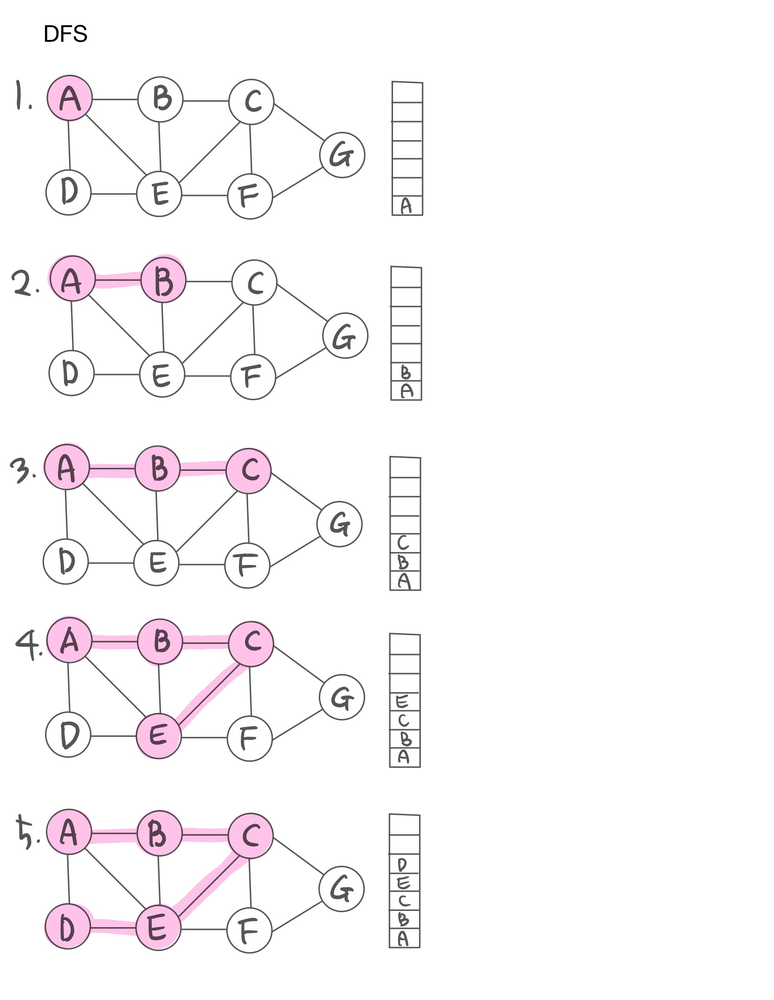
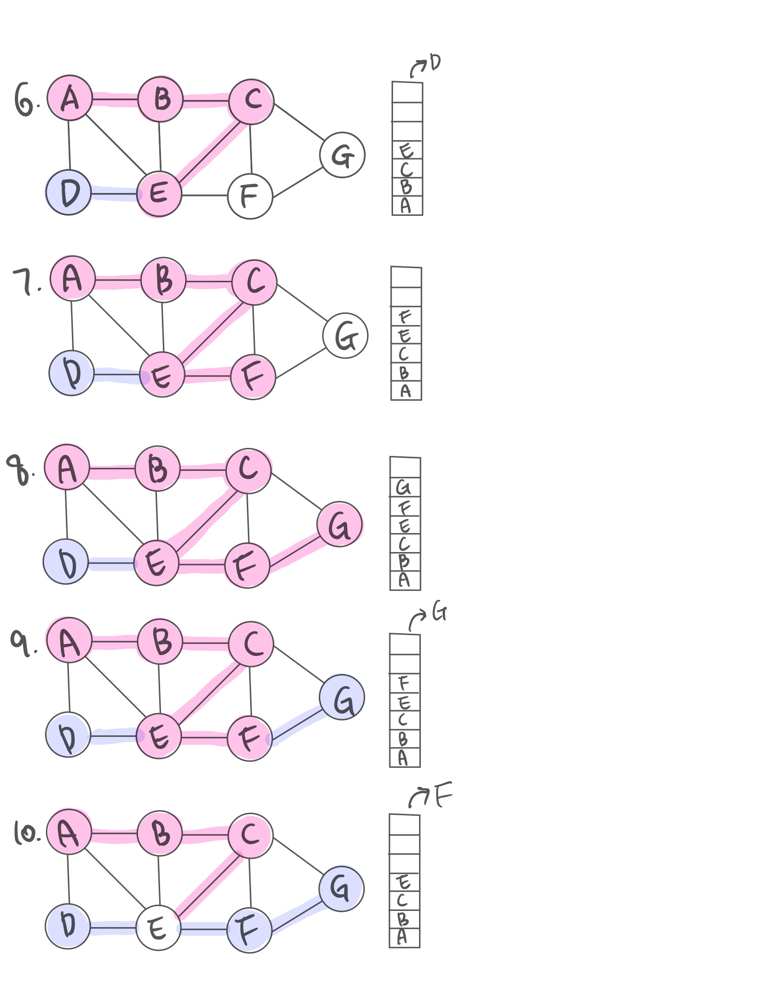
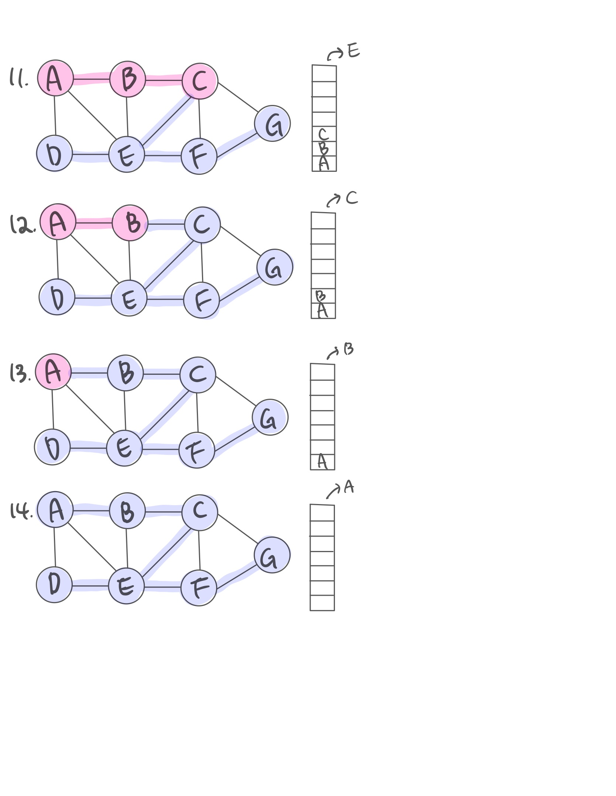
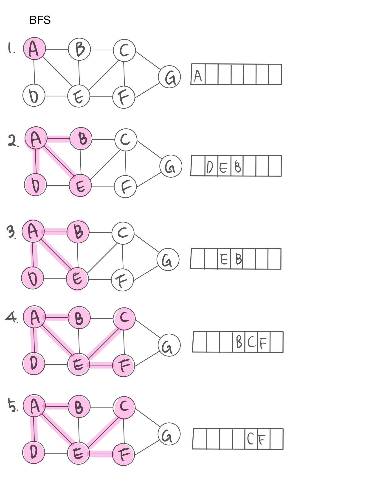
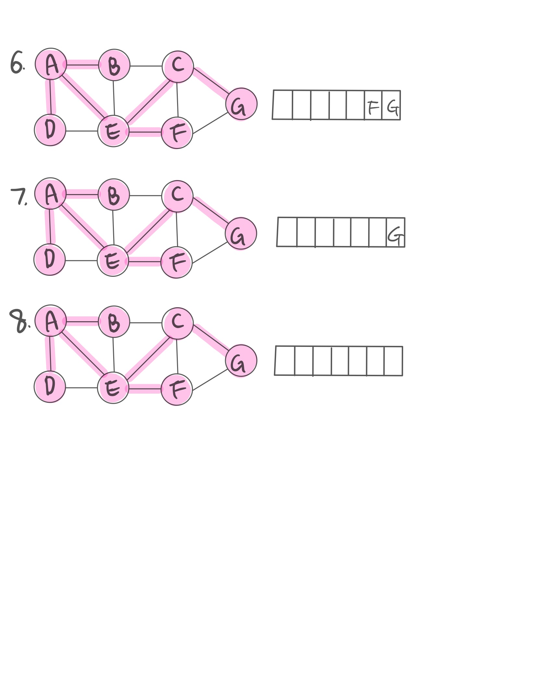

# HW09
## 깊이우선탐색(DFS, Depth-First Search) 
깊이우선탐색은 이름 그대로 그래프에서 깊은 부분을 우선적으로 탐색하는 알고리즘이다. 루트 노드에서 시작하여 다음 분기로 넘어가기 전에 해당 분기를 완벽하게 탐색한다.  
- 미로를 탐색할 때 한 방향으로 갈 수 있을 때까지 계속 가다가 더 이상 갈 수 없게 되면 다시 가장 가까운 갈림길로 돌아와서 이곳으로부터 다른 방향으로 다시 탐색을 진행하는 방법과 유사하다.  
- 스택(Stack) 자료구조를 사용한다.
- 동작 방법
  1. 스택의 사이즈를 정점의 개수로 정의한다. 
  2. 아무 정점을 하나 선택해 선택점을 지정한다. 그 정점을 방문하고 스택에 push 한다.
  3. 스택의 맨 위에 있는 정점이랑 인접한 정점 주에 방문하지 않은 정점 하나를 방문하여 스택에 push 한다. 
  4. 스택의 맨 위에 있는 정점에서 방문할 새로운 정점이 없을 때 까지 1~3단계를 반복한다.
  5. 방문할 새로운 정점이 없으면 __역추적(Back Tracking)__ 을 하고 추적된 정점들을 pop 한다.
    - Back Tracking: 다시 돌아가서 탐색하지 않은 정점이 있는지 확인하는 단계. 역추적이 없을 경우 __무한루프__ 에 빠질 위험이 있다. 
  7. 스택이 빌 때 까지 3~5단계를 반복한다.
  8. 스택이 비게되면 사용하지 않은 간선들을 삭제해서 스패닝 트리를 형성한다. 
__DFS 과정 그림으로 확인__   
  
  
  
### 경로 : D → G → F → E → C → B → A   
출력의 순서와 과정은 스택으로 이루어지기 때문에 __후입선출__ 의 형식을 띈다. 
```C++
void DFS(int _s) {
		visited[_s] = true; // 루트 노드를 방문 처리
		list<int>::iterator iter; // 정점들은 리스트로 연결되어 있어 iterator를 이용해 탐색
		for (iter = adj[_s].begin(); iter != adj[_s].end(); iter++) {
			if (!visited[*iter]) {
				DFS(*iter); // 방문 하지 않은 노드의 경우 방문 처리
			}
		}
	}
```
## 이진트리에서의 깊이우선탐색 - 중의 순회(InOrder)
이진트리에서 깊이우선탐색의 방법
1. InOrder: Left → Push → Right
2. PreOrder: Push → Left → Right
3. PostOrder: Left → Right → Push

학교에서 다뤘던 InOrder를 설명하겠다.   
쉽게 말해서 
```C++
DFSInOrder() {
    const data = [];
    function traverse(node) {
      if (node.left) 
      	traverse(node.left);
      	data.push(node.value); // 다른 DFS와 비교하면 이 라인의 위치만 다름
      if (node.right) 
      	traverse(node.right);
    }
    traverse(this.root);
    return data;
  }
```
## 너비우선탐색(Breadth First Search)
너비우선탐색은 그래프에서 가장 가까운 노드부터 탐색하고 멀리 떨어져 있는 정점을 나중에 방문하는 방법이다. 즉, 탐색하기 전에 넓게 탐색하는 것이다. 
- 큐(Queue) 자료구졸르 사용한다.
- 동작 방법
  1. 큐의 사이즈를 정점의 개수로 정의한다.
  2. 아무 정점을 하나 선택해 선택점을 지정한다. 그 정점을 방문하고 큐에 삽입(enqueue)한다.
  3. 큐의 가장 앞에 있는 정점의 인접한 정점을 __전부__  탐색하고 삽입한다.
  4. 큐의 가장 앞에 있는 정점의 인접한 정점을 전부 탐색했으면 그 정점을 큐에서 꺼낸다.
  5. 3~4 단계를 큐가 빌 때까지 반복한다.
  6. 큐가 비게 되면, 사용하지 않은 간선을 지워서 스패닝 트리를 형성한다. 
__BFS 과정 그림으로 확인__


### 경로 : A → D → E → B → C → F → G   
```C++
void BFS_dock(int _s) { // 정거장이 하나 
	visited[_s] = true;// 루트 노드 방문 처리 
	queue<int> Q; // 큐를 만듦
	Q.push(_s); // 시작점 _s를 큐에 넣음 
	while (!Q.empty()) { // 큐에 더이상 정점이 남아있지 않을 때까지 반복
		_s = Q.front(); // 큐에 가장 먼저 들어간 정점의 값을 꺼냄
		Q.pop(); // 꺼낸 큐의 정점은 큐에서 삭제 
		list<int>::iterator iter;어 있으니 iterator를 이용해 탐색합니다. 
		for (iter = adj[_s].begin(); iter != adj[_s].end(); ++iter) {
			if (!visited[*iter]) { // 방문 하지 않은 노드의 경우 방문 처리
				visited[*iter] = true; // _s 근처의 *iter 정점 중 방문하지 않은 경우 방문
				Q.push(*iter); // 방문한 근처 정점 *iter를 큐에 넣음
				dist[*iter] = dist[_s] + 1; // _s+1만큼 떨어져 있음
			}
		}
	}
}
void BFS_docks(vector<int> _docks) {//정거장이 여러개
		int n_docks = _docks.size();
		queue < int> Q;
		for (int i = 0; i < n_docks; i++) {
			visited[_docks[i]] = true;
			Q.push(_docks[i]);
		}
		int _s = 0;
		while (!Q.empty()) {
			_s = Q.front();
			Q.pop();
			list<int>::iterator iter;
			for (iter = adj[_s].begin(); iter != adj[_s].end(); iter++) {
				if (!visited[*iter]) {
					Q.push(*iter);
					visited[*iter] = true;
					dist[*iter] = dist[_s] + 1;
				}
			}
		}
		
```
