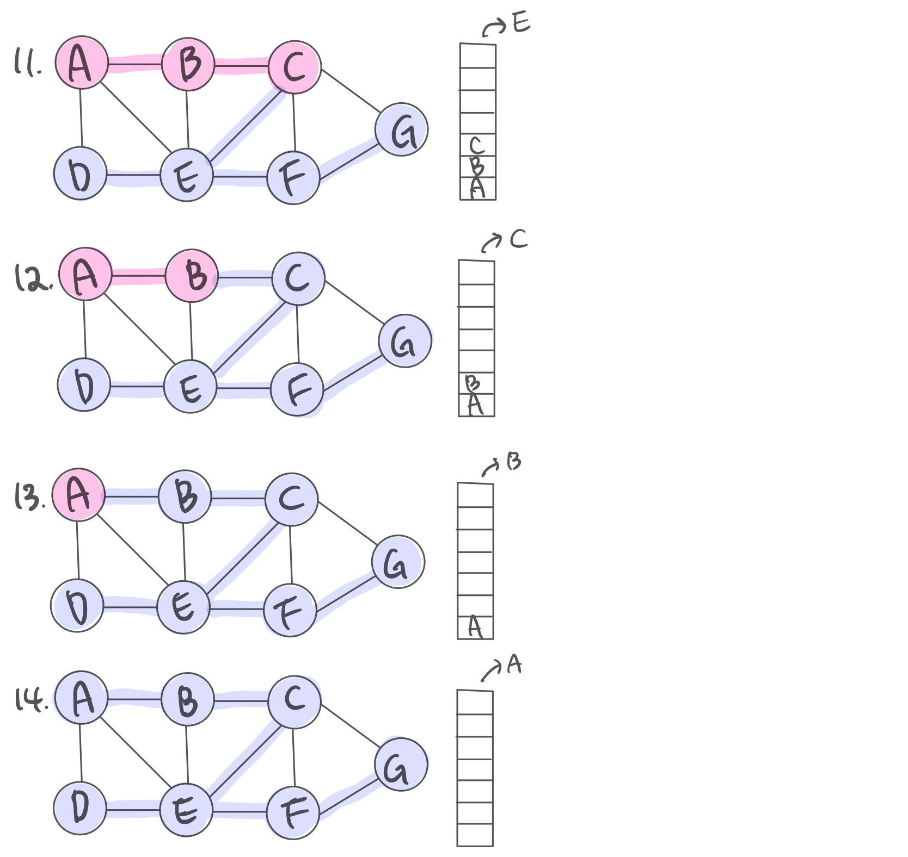
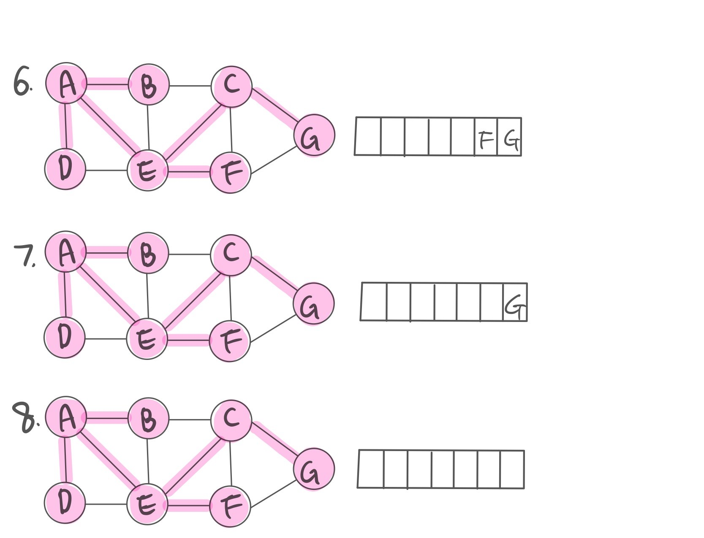

# HW09
## 깊이우선탐색(DFS, Depth-First Search) 
깊이우선탐색은 이름 그대로 그래프에서 깊은 부분을 우선적으로 탐색하는 알고리즘이다. 루트 노드에서 시작하여 다음 분기로 넘어가기 전에 해당 분기를 완벽하게 탐색한다.  
- 미로를 탐색할 때 한 방향으로 갈 수 있을 때까지 계속 가다가 더 이상 갈 수 없게 되면 다시 가장 가까운 갈림길로 돌아와서 이곳으로부터 다른 방향으로 다시 탐색을 진행하는 방법과 유사하다.  
- 스택(Stack) 자료구조를 사용한다.
- 동작 방법
  1. 스택의 사이즈를 정점의 개수로 정의한다. 
  2. 아무 정점을 하나 선택해 선택점을 지정한다. 그 정점을 방문하고 스택에 push 한다.
  3. 스택의 맨 위에 있는 정점이랑 인접한 정점 주에 방문하지 않은 정점 하나를 방문하여 스택에 push 한다. 
  4. 스택의 맨 위에 있는 정점에서 방문할 새로운 정점이 없을 때 까지 1~3단계를 반복한다.
  5. 방문할 새로운 정점이 없으면 __역추적(Back Tracking)__ 을 하고 추적된 정점들을 pop 한다.
    - Back Tracking: 다시 돌아가서 탐색하지 않은 정점이 있는지 확인하는 단계. 역추적이 없을 경우 __무한루프__ 에 빠질 위험이 있다. 
  7. 스택이 빌 때 까지 3~5단계를 반복한다.
  8. 스택이 비게되면 사용하지 않은 간선들을 삭제해서 스패닝 트리를 형성한다. 
__DFS 과정 그림으로 확인__   
  
  
  
### 경로 : D → G → F → E → C → B → A   
출력의 순서와 과정은 스택으로 이루어지기 때문에 __후입선출__ 의 형식을 띈다. 
```C++
void DFS(int _s) {
		visited[_s] = true; // 루트 노드를 방문 처리
		list<int>::iterator iter; // 정점들은 리스트로 연결되어 있어 iterator를 이용해 탐색
		for (iter = adj[_s].begin(); iter != adj[_s].end(); iter++) {
			if (!visited[*iter]) {
				DFS(*iter); // 방문 하지 않은 노드의 경우 방문 처리
			}
		}
	}
```
## 이진트리에서의 깊이우선탐색 - 중의 순회(InOrder)
이진트리에서 깊이우선탐색의 방법
1. InOrder: Left → Push → Right
2. PreOrder: Push → Left → Right
3. PostOrder: Left → Right → Push

학교에서 다뤘던 InOrder를 설명하겠다.   
- 쉽게 말해서 왼쪽 자식이 있으면 왼쪽으로 가고, 없으면 push한다. 그리고 오른쪽 자식 노드로 간다. 오른쪽 자식 노드에도 왼쪽 자식 노드가 있으면 앞서 말한 과정을 반복한다. 즉, 한번 왼쪽으로 갔으면 그 다음 단계는 push이며 오른쪽 자식노드로 가면 된다. 오른쪽으로 가기 전에 push 한다고 생각하면 쉽다.
```C++
DFSInOrder() {
    const data = [];
    function traverse(node) {
      if (node.left) 
      	traverse(node.left);
      	data.push(node.value); // 다른 DFS와 비교하면 이 라인의 위치만 다름
      if (node.right) 
      	traverse(node.right);
    }
    traverse(this.root);
    return data;
  }
```
## 너비우선탐색(Breadth First Search)
너비우선탐색은 그래프에서 가장 가까운 노드부터 탐색하고 멀리 떨어져 있는 정점을 나중에 방문하는 방법이다. 즉, 탐색하기 전에 넓게 탐색하는 것이다. 
- 큐(Queue) 자료구졸르 사용한다.
- 동작 방법
  1. 큐의 사이즈를 정점의 개수로 정의한다.
  2. 아무 정점을 하나 선택해 선택점을 지정한다. 그 정점을 방문하고 큐에 삽입(enqueue)한다.
  3. 큐의 가장 앞에 있는 정점의 인접한 정점을 __전부__  탐색하고 삽입한다.
  4. 큐의 가장 앞에 있는 정점의 인접한 정점을 전부 탐색했으면 그 정점을 큐에서 꺼낸다.
  5. 3~4 단계를 큐가 빌 때까지 반복한다.
  6. 큐가 비게 되면, 사용하지 않은 간선을 지워서 스패닝 트리를 형성한다. 
__BFS 과정 그림으로 확인__


### 경로 : A → D → E → B → C → F → G   
```C++
void BFS_dock(int _s) { // 정거장이 하나 
	visited[_s] = true;// 루트 노드 방문 처리 
	queue<int> Q; // 큐를 만듦
	Q.push(_s); // 시작점 _s를 큐에 넣음 
	while (!Q.empty()) { // 큐에 더이상 정점이 남아있지 않을 때까지 반복
		_s = Q.front(); // 큐에 가장 먼저 들어간 정점의 값을 꺼냄
		Q.pop(); // 꺼낸 큐의 정점은 큐에서 삭제 
		list<int>::iterator iter;어 있으니 iterator를 이용해 탐색합니다. 
		for (iter = adj[_s].begin(); iter != adj[_s].end(); ++iter) {
			if (!visited[*iter]) { // 방문 하지 않은 노드의 경우 방문 처리
				visited[*iter] = true; // _s 근처의 *iter 정점 중 방문하지 않은 경우 방문
				Q.push(*iter); // 방문한 근처 정점 *iter를 큐에 넣음
				dist[*iter] = dist[_s] + 1; // _s+1만큼 떨어져 있음
			}
		}
	}
}
void BFS_docks(vector<int> _docks) {//정거장이 여러개
		int n_docks = _docks.size();
		queue < int> Q;
		for (int i = 0; i < n_docks; i++) {
			visited[_docks[i]] = true;
			Q.push(_docks[i]);
		}
		int _s = 0;
		while (!Q.empty()) {
			_s = Q.front();
			Q.pop();
			list<int>::iterator iter;
			for (iter = adj[_s].begin(); iter != adj[_s].end(); iter++) {
				if (!visited[*iter]) {
					Q.push(*iter);
					visited[*iter] = true;
					dist[*iter] = dist[_s] + 1;
				}
			}
		}
		
```

## 두 탐색 알고리즘 비교
|깊이우선탐색|너비우선탐색|
|:---:|:---:|
|__스택__ 으로 표현|__큐__ 로 구현|
|각의 경로마다 특징을 저장해둬야 할 때는 DFS를 사용|너비우선탐색은 경로의 특징을 갖지 못함|
|깊이우선탐색으로 경로를 검색할 경우 처음으로 발견되는 해답이 최단거리가 아닐 수 있음|미로 찾기 등 최단거리를 구해야 할 때 유리. 너비우선탐색은 현재 노드에서 가까운 곳부터 찾기 때문에 경로를 탐색 시 먼저 찾아지는 해답이 곧 최단거리임.|

코드 정리
```C++
#include <iostream>
#include <vector>
#include <queue>
#include <list>
using namespace std;
class CGraph {
	int n_vertices;
	bool* visited;
	vector<list<int>> adj;
	vector<int> dist;
public:
	CGraph(int _n) {
		this->n_vertices = _n;
		visited = new bool[_n];
		for (int i = 0; i < _n; i++) {
			visited[i] = false;
		}
		adj.resize(_n); //초기화
		adj.resize(_n);
	}
	~CGraph() {
		delete visited;
	}
	void addUndirectedEdge(int _s, int _d) {
		adj[_s].push_back(_d);
		adj[_d].push_back(_s);
		//방향 없음
	}
	void addEdge(int _s, int _d) {
		adj[_s].push_back(_d); //방향 있음
	}
	void BFS_dock(int _s) { // 정거장이 하나 
		visited[_s] = true;// 루트 노드 방문 처리 
		queue<int> Q; // 큐를 만듦
		Q.push(_s); // 시작점 _s를 큐에 넣음 
		while (!Q.empty()) { // 큐에 더이상 정점이 남아있지 않을 때까지 반복
			_s = Q.front(); // 큐에 가장 먼저 들어간 정점의 값을 꺼냄
			Q.pop(); // 꺼낸 큐의 정점은 큐에서 삭제 
			list<int>::iterator iter; 
				for (iter = adj[_s].begin(); iter != adj[_s].end(); ++iter) {
					if (!visited[*iter]) { // 방문 하지 않은 노드의 경우 방문 처리
						visited[*iter] = true; // _s 근처의 *iter 정점 중 방문하지 않은 경우 방문
						Q.push(*iter); // 방문한 근처 정점 *iter를 큐에 넣음
						dist[*iter] = dist[_s] + 1; // _s+1만큼 떨어져 있음
					}
				}
		}
	}
	void DFS(int _s) {
		visited[_s] = true;
		//cout << _s << " ";
		list<int>::iterator iter;
		for (iter = adj[_s].begin(); iter != adj[_s].end(); iter++) {
			if (!visited[*iter]) {
				DFS(*iter);
			}
		}
	}
};
```
## BFS 관련 문제
### 백준 2178번 : 미로 탐색


```C++
#include <iostream>
#include <queue>
using namespace std;
 
string map[100]; 
int dis[100][100]; // 방문 기록용
int dx[4] = {1, -1, 0, 0}; // 상하좌우 x축 방향
int dy[4] = {0, 0, 1, -1}; // 상하좌우 y축 방향
int n,m; // 미로 크기 변수
queue<pair<int, int> > q; // 탐색 좌표 저장용 큐

void bfs(int x,int y) {
    q.push(make_pair(x, y)); // 큐에 삽입
	dis[x][y] = 1; // 시작 좌표 방문
	while (!q.empty()) {
		x = q.front().first; //큐의 front 좌표를 현재 좌표로 지정
		y = q.front().second;
		q.pop();
		for (int i = 0; i < 4; i++) {
			// 현재 좌표와 인접한 좌표
			int nx = x + dx[i];
			int ny = y + dy[i];
			if ((0 <= nx && nx < n) && (0 <= ny && ny < m) && dis[nx][ny] == 0 && map[nx][ny] == '1') { 
			// 인접 좌표가 존재하는지, 방문 여부와 이동 여부 확인
				q.push(make_pair(nx, ny)); // 인접 좌표 큐에 삽입
				dis[nx][ny] = dis[x][y] + 1; // 인접 좌표 이동거리 저장
			}
		}
	}
}
int main(void) {
    cin >> n>> m; // 미로 크기
    for (int i = 0; i < n; i++) // 행 입력
		cin >> map[i];
    bfs(0,0); // 미로 탐색 시작
	cout << dis[n - 1][m - 1]; // 도착 좌표까지의 거리 출력
}


```
