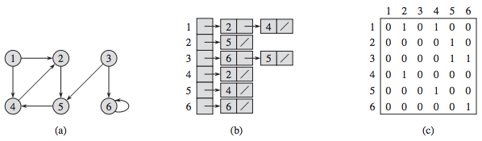

## 그래프의 표현 방법 2가지
## 인접 행렬과 인접 리스트
   
a: 무방향 그래프, b: 인접 리스트, c: 인접 행렬
   
a: 방향 그래프, b: 인접 리스트, c: 인접 행렬

### 인접 행렬(Adjacency-matrix)
- 정점의 개수를 V개라고 했을 때, V x V 크기의 이차원 배열(행렬모양)에 저장한다.
- A[i][j] = 1 or 0  (i->j 간선이 있을 때는 1, 없을 떄는 0) 로 주로 표현을 많이 한다.
- 양방향 그래프의 경우 이차원 배열에 저장했을 때 대각선을 기준으로 대칭을 이룬다는 특징이 있다.
- 인접행렬은 자주 사용하지 않는 방식인데, 그 이유는 존재하지 않는 간선에 대한 정보까지도 저장하기 때문이다.
   정점의 개수가 V개이면 간선의 개수 E는 보통 V^2 >= E 이기 때문에 최대크기인 V x V를 사용하는 이 방식은 비효율적이므로, 이 방식은 주로 쉬운 문제를 풀 때만 사용한다.
- 간선에 가중치가 존재한다면 A[i][j]에 0 또는 1 대신 가중치 값을 넣어주면 된다.
   <이때의 예외상황>
   1) 가중치의 값이 w >=0 이라면, 간선이 없는 곳은 0대신 -1을 넣어 구별해줄 수 있다.
   2) 가중치의 값이 모든 범위의 정수라면, 인정행렬 2개를 만들어 해결해야하는데,
       인접하면 1 아니면 0을 저장한 행렬 1개, 인접한 곳의 가중치를 저장한 행렬 1개 즉, 총 2개의 인접행렬을 만들어 해결할 수 있다
```C++
#include <iostream>
using namespace std;
int vertices; // 정점 개수
int adjacency; // 간선 개수
int adj[10][10]; //간선을 10x10 행렬
int main() {
    cin >> vertices >> adjacency;
    for (int i=0; i < adjacency; i++) {
      int a, b;
      cin >> a >> b;  
      adj[a][b] = 1; // 무방향 그래프 이므로 
      adj[b][a] = 1; // 양방향의 간선이 1의 가중치를 가진다
    }
}
```
### 인접 리스트(Adjacency-list)
- A[i] = i와 연결된 정점들을 링크드 리스트로 저장함(__연결된 정점이 저장되어 있지만 이들은 정점 i와 각 정점 간의 간선을 의미한다__)
- 정점에 따라서 연결된 정점의 개수가 다르기 때문에 각기 다른 저장공간의 크기를 효율적으로 관리하기 위해 링크드 리스트를 사용.
- linked list도 사용가능하지만 주로 __STL Vector__ 가 많이 쓰인다.
- 두 노드간의 간선이 여러개인 경우 인접행렬 보다 인접리스트를 사용하는 것이 좋은데, 그 복잡한 관계는 인접행렬 1개 만으로 나타낼 수 없으나 인접리스트는 이것이 가능하기 때문이다.
- 인접행렬의 경우 공간이 V^2 만큼 필요한데, 인접리스트는 모든 간선을 1번씩 저장하기 때문에 E개 만큼 필요하다.
- 가중치가 있는 경우 __pair<int, int>__ 형을 가지는 2차원 벡터로 해결할 수 있다.
```C++
#include <iostream>
using namespace std;
int vertices; // 정점 개수
int adjacency; // 간선 개수
vector<int> adj[10];
int main() {
    cin >> vertices >> adjacency;
    for (int i=0; i < vertices; i++) {
      int a, b;
      cin >> a >> b;
      adj[a].push_back(b);
      adj[b].push_back(a);
    }
}
```
### 그래프의 구성
```C++
class CGraph {
	int n_vertices; // 정점의 개수
	bool* visited; // 지나간 경로인지 아닌지를 판단하는 bool형 포인터
	int* paths; // 지나온 경로를 포인터로 설정
	int _idx; // 현재 위치
	vector <list<int>> adj; // 정점의 간선을 리스트 벡터로 표현
	vector<int> dist; // 간선의 길이를 벡터로 표현
 ```

## 다익스트라 알고리즘과 코드
다익스트라 알고리즘은 최단 경로 탐색 기능이 추가된 그래프이다. 시작노드를 임의로 정해서 최소 가중치가 선택된 정점을 선택해 간선을 업데이트하며 이것이 계속 반복되는 형식으로 진행된다.
1. 시작 노드와 직접적으로 연결된 모든 정점들의 거리를 비교해서 업데이트 시켜주고, 시작 노드를 방문한 노드로 체크한다.
2. 방문한 정점들과 연결되어 있는 정점들 중, 비용이 가장 적게 드는 정점을 선택하고, 해당 정점을 방문한 정점으로 선택해준다.
3. 2번 과정에 의해서 갱신될 수 있는 정점들의 거리를 갱신시켜준다.
4. 2 ~ 3번 과정을 반복한다.
다익스트라 알고리즘을 고려할 때 제일 중요한 것이 __양의 가중치__ 만 적용가능하다. 그렇기 때문에 이미 방문했던 정점을 다시 방문해서 업데이트를 할 필요가 없는 것이다!

## BFS 관련 문제
### 백준 2178번 : 미로 탐색


```C++
#include <iostream>
#include <queue>
using namespace std;
 
string map[100]; 
int dis[100][100]; // 방문 기록용
int dx[4] = {1, -1, 0, 0}; // 상하좌우 x축 방향
int dy[4] = {0, 0, 1, -1}; // 상하좌우 y축 방향
int n,m; // 미로 크기 변수
queue<pair<int, int> > q; // 탐색 좌표 저장용 큐

void bfs(int x,int y) {
    q.push(make_pair(x, y)); // 큐에 삽입
	dis[x][y] = 1; // 시작 좌표 방문
	while (!q.empty()) {
		x = q.front().first; //큐의 front 좌표를 현재 좌표로 지정
		y = q.front().second;
		q.pop();
		for (int i = 0; i < 4; i++) {
			// 현재 좌표와 인접한 좌표
			int nx = x + dx[i];
			int ny = y + dy[i];
			if ((0 <= nx && nx < n) && (0 <= ny && ny < m) && dis[nx][ny] == 0 && map[nx][ny] == '1') { 
			// 인접 좌표가 존재하는지, 방문 여부와 이동 여부 확인
				q.push(make_pair(nx, ny)); // 인접 좌표 큐에 삽입
				dis[nx][ny] = dis[x][y] + 1; // 인접 좌표 이동거리 저장
			}
		}
	}
}
int main(void) {
    cin >> n>> m; // 미로 크기
    for (int i = 0; i < n; i++) // 행 입력
		cin >> map[i];
    bfs(0,0); // 미로 탐색 시작
	cout << dis[n - 1][m - 1]; // 도착 좌표까지의 거리 출력
}
```

